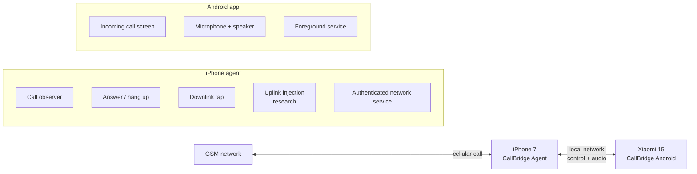

# Proposed architecture

## System boundary

## iPhone side

A single `callbridge-agent` process is proposed:

- Listens to CoreTelephony and CallKit events.
- Reduces those events to one call state machine.
- Executes `answer`, `reject` and `hangup` commands from an authorized client.
- Converts downlink PCM into live audio frames.
- Feeds frames from the Android microphone into the uplink path; this part is the experimental gate.
- Starts automatically after a jailbreak via a rootless LaunchDaemon.

In the first release the agent can be derived from the existing TrollRecorder CLI code in
Objective-C++/Theos. Under the rootless layout the package path must be `/var/jb/usr/local/bin`
and the LaunchDaemon path `/var/jb/Library/LaunchDaemons`.

## Android side

A Kotlin app on stock Android is proposed:

- A foreground service keeps the local connection alive.
- A Compose UI shows the caller and the call state.
- Answer, reject and hang up commands are sent to the agent.
- `AudioRecord` handles the microphone, `AudioTrack` plays the far end.
- Android Telecom integration can be considered later; a custom full-screen call UI is enough for
  the first PoC.

## Protocol

Control runs over a single authenticated TCP connection carrying newline-delimited JSON. The full
contract — message types, fields, error codes, pairing and idempotency — is
[PROTOCOL.md](PROTOCOL.md); it is what both the agent and the Android client code against.

WebSocket was the original plan and was dropped: the client is a native app, so the handshake,
masking and frame layer would have to be hand-written on the iOS side for no benefit here. Audio
does not share the control connection; it gets its own stream with length-prefixed binary frames.

Every command must be applied at most once per `requestId` and must produce an explicit result
message.

## Audio transport plan

The verified source format is 44.1 kHz stereo Float32 PCM. The first live experiment can start
with raw PCM to keep conversion cost low. Once the link works:

1. Convert the downlink to mono 16 or 24 kHz PCM.
2. Use 20 ms frames with sequence numbers.
3. Add a jitter buffer and latency measurement.
4. Move to Opus if needed.

Recording to a file should remain available alongside live streaming as a diagnostic option.

## Network and security

- The service must only listen on local interfaces.
- A long, randomly generated key must be used at first pairing.
- Control commands must not be accepted without authentication.
- Start with a single active Android client at a time.
- Phone numbers must be masked in logs by default.
- Client access to the iPhone over its hotspot must be tested separately; an SSH test that works
  over Wi-Fi does not by itself prove hotspot behavior.

## Core technical risk

`call-recorder microphone` captures audio from the iPhone's microphone. That does not prove we can
write audio from the network into the modem uplink. Uplink injection must be treated as a separate
low-level experiment, and if it fails the product architecture has to be reconsidered.
